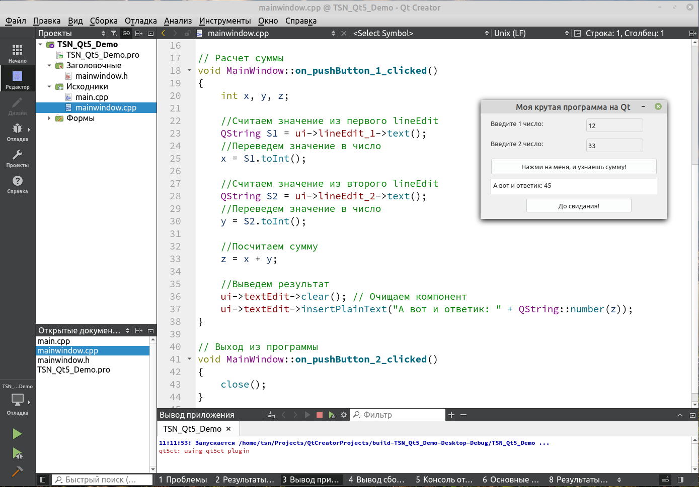

# TSN_Qt5_Demo
Пример простейшей программы на Qt5 в QtCreator (linux)



```
#include "mainwindow.h"
#include "ui_mainwindow.h"

MainWindow::MainWindow(QWidget *parent)
    : QMainWindow(parent)
    , ui(new Ui::MainWindow)
{
    ui->setupUi(this);
}

MainWindow::~MainWindow()
{
    delete ui;
}


// Расчет суммы
void MainWindow::on_pushButton_1_clicked()
{
    int x, y, z;

    //Считаем значение из первого lineEdit
    QString S1 = ui->lineEdit_1->text();
    //Переведем значение в число
    x = S1.toInt();

    //Считаем значение из второго lineEdit
    QString S2 = ui->lineEdit_2->text();
    //Переведем значение в число
    y = S2.toInt();

    //Посчитаем сумму
    z = x + y;

    //Выведем результат
    ui->textEdit->clear(); // Очищаем компонент
    ui->textEdit->insertPlainText("А вот и ответик: " + QString::number(z));
}

// Выход из программы
void MainWindow::on_pushButton_2_clicked()
{
    close();
}

```
