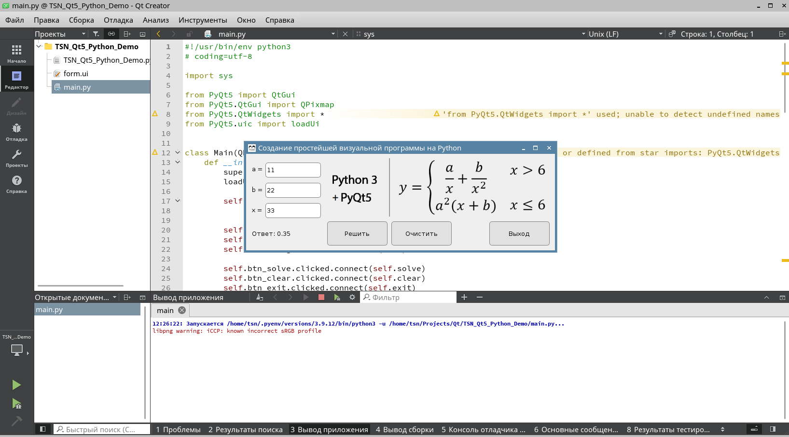

# TSN_Qt5_Demo
Пример простейшей программы на PyQt5 в QtCreator (linux)



```
#!/usr/bin/env python3
# coding=utf-8

import sys

from PyQt5 import QtGui
from PyQt5.QtGui import QPixmap
from PyQt5.QtWidgets import *
from PyQt5.uic import loadUi


class Main(QDialog):
    def __init__(self):
        super(Main, self).__init__()
        loadUi('form.ui', self)  # загрузка формы в py-скрипт

        self.setWindowTitle('Создание простейшей визуальной '
                            'программы на Python')

        self.setWindowIcon(QtGui.QIcon('logo.png'))
        self.label_img.setPixmap(QPixmap('main.png'))
        self.label_img.setScaledContents(True)

        self.btn_solve.clicked.connect(self.solve)
        self.btn_clear.clicked.connect(self.clear)
        self.btn_exit.clicked.connect(self.exit)

    def solve(self):
        a = self.lineEdit_a.text()
        b = self.lineEdit_b.text()
        x = self.lineEdit_x.text()

        if validation_of_data(a, b, x):
            a = float(a)
            b = float(b)
            x = float(x)

            if x > 6:
                answer = (a / x) + b / (x ** 2)
            else:
                answer = (a ** 2) * (x + b)

            self.label_answer.setText('Ответ: ' + str(format(answer, '.2f')))
        else:
            self.label_answer.setText(
                'Ошибка!')

    def clear(self):
        self.lineEdit_a.setText('')
        self.lineEdit_b.setText('')
        self.lineEdit_x.setText('')
        self.label_answer.setText('Ответ: ')

    def exit(self):
        self.close()


def validation_of_data(a, b, x):
    """
    проверяем валидность наших данных, с помощью перехвата исключения
    :param a: число, полученное из lineEdit_a
    :param b: число, полученное из lineEdit_b
    :param x: число, полученное из lineEdit_x
    :return: True - прошло валидацию, False - нет
    """
    try:
        float(a)
        float(b)
        float(x)

        return True
    except Exception:
        return False


def main():
    # каждое приложение должно создать объект QApplication
    # sys.argv - список аргументов командной строки
    app = QApplication(sys.argv)
    window = Main()  # базовый класс для всех объектов интерфейса пользователя
    window.show()  # отобразить окно на экране
    sys.exit(app.exec_())  # запуск основного цикла приложения


if __name__ == '__main__':
    main()
```
